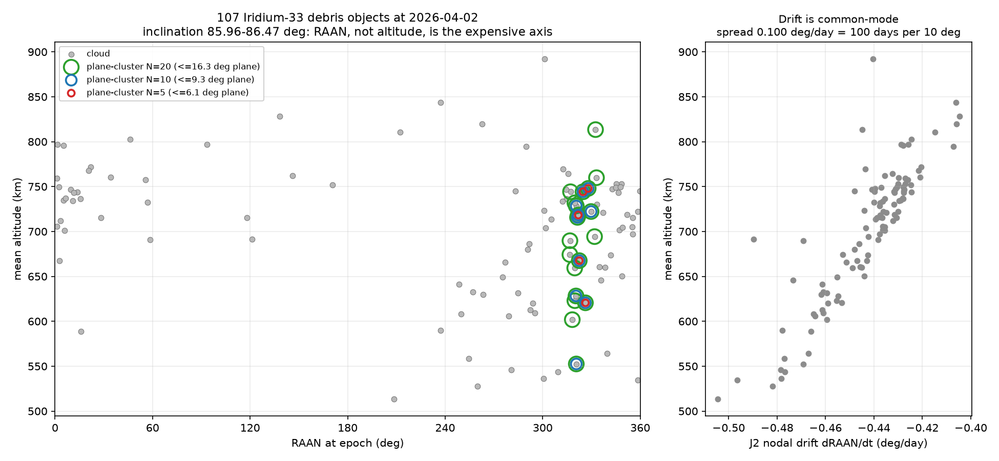

# Dextrivia

**An honest benchmark of classical, quantum-inspired and quantum solvers on a real orbital-debris sequencing problem.**

Given N catalogued fragments of the Iridium-33 debris cloud and a delta-v cost to
transfer between any two, find the visiting order that costs the least. The
deliverable of this repository is **the comparison**, not any one solver.

<!-- HEADLINE-FIGURE -->

<!-- HEADLINE-TABLE -->

<!-- HEADLINE-PROSE -->

---

## The problem, and why it matters

The 2009 Iridium-33 / Cosmos-2251 collision left more than 2,000 trackable
fragments in low Earth orbit. Active debris removal — sending a servicer to
capture several of them in one mission — is limited by propellant, so the
*order* in which targets are visited decides whether a mission is affordable.

The mission is an **open path, not a TSP tour**. The servicer starts at the
first object of the sequence and stops at the last. There is no return leg and
no depot, so a sequence over N objects has exactly **N-1 legs**. This matters
more than it sounds: the textbook TSP QUBO would charge the mission for a leg it
never flies, and every solver, cost model and formulation here is written
against the open-path definition.

Sequencing is NP-hard in general, which is what makes it a standard candidate
for quantum and quantum-inspired optimisation — and what makes an honest
classical baseline mandatory before anyone says the word "advantage".

---

## The physics model, and what it assumes

Full write-up: **[`docs/physics.md`](docs/physics.md)**.

Each object's orbit comes from its TLE, propagated with SGP4 to a common epoch —
the snapshot's **median TLE epoch**, never a hardcoded date. Transfer cost is a
two-burn impulsive manoeuvre between circular orbits at each object's **mean
semi-major axis**, with the plane change folded into the burns and the split
between them solved numerically rather than assumed.

The single fact that shapes everything:

| Quantity | This cloud |
|---|---|
| Mean altitude | 513 – 892 km |
| Inclination | 85.96° – 86.47° (spread **0.51°**) |
| RAAN | **the full circle** |
| Median pairwise plane angle | **45.5°** |
| Impulsive cost of that median plane change at 700 km | **5.80 km/s** |

Inclination alone says the cloud is one orbit. RAAN says it is 107 of them.
The exchange rate at 700 km is **1° of plane ≈ 0.131 km/s** against **100 km of
altitude ≈ 0.053 km/s** — both matter, which is exactly what makes the
sequencing non-trivial.



Because a median leg costs more than a launch to GEO, full-cloud tours are
physically absurd. Instances are built by a **`plane-cluster` rule** fixed before
any solver runs: keep the objects nearest a seed object in true plane angle.
The rule never looks at delta-v, let alone at which solver wins on the result.

**Time dependence.** J2 makes the orbital nodes regress. Leg *k* is priced at
`epoch + k · 30 days`, so a `td30d` instance carries a cost array `C[t,i,j]`
where `t` is the position of the leg in the sequence. The drift here is
**common-mode** (−0.405 to −0.505 °/day), so it largely cancels: the
*differential* rate for a median pair is 0.016 °/day, i.e. **612 days to change
their separation by 10°**. Waiting buys very little, and this repository does
not pretend otherwise.

### What the model still ignores

Phasing (the largest omission — the servicer is assumed to arrive at the right
point in the target's orbit for free), three-burn bi-elliptic transfers (so
every large-angle cost is an upper bound), eccentricity, finite burns and
gravity losses, time windows, propellant budget, vehicle constraints, and
conjunction-risk weighting. None of these exist here.

---

## Why the first version of this project was wrong

This repository began as an altitude-only tool. Three things were wrong with it,
and all three are visible in the git history rather than reconstructed.

**1. The propagation ran ~15 months backward.** `text_cost_matrix.py` in
[`e837989`](../../commit/e837989) hardcoded `datetime(2025, 1, 1, 12, 0, 0)`
while the TLE set's median epoch is `2026-04-02T07:05:22Z` — **455 days, 14.9
months, in the wrong direction**. SGP4 is a *fitted* model whose accuracy decays
away from its own epoch in either direction. Propagating this snapshot back to
that date moves mean altitudes by +20.0 km on average and up to 108 km, and
SGP4 refuses outright (error 6, decayed) on 1 of the 107 objects. The epoch is
now a parameter that defaults to the snapshot's median TLE epoch, and there are
no hardcoded calendar dates anywhere in the package.

**2. Altitude was the instantaneous radius, with the wrong Earth.**
`propagation.py` computed `|r| − 6371 km`. Two errors stacked: `|r|` oscillates
once per orbit (about 285 km peak-to-peak for the most eccentric object here),
and 6371 km is the mean spherical radius while SGP4 works internally in WGS72
(6378.135 km). Against the mean semi-major axis the old figure disagrees by
+8.9 km on average and up to **144 km** per object — encoding "where the object
happened to be at the chosen instant" into a cost matrix that is supposed to
describe its orbit. Altitude is now `Satrec.am`, the mean semi-major axis, with
WGS72 throughout.

**3. The benchmark was degenerate, which is the one that actually mattered.**
The coplanar Hohmann model derives every cost from **one scalar per object**.
Objects on a single scalar axis lie on a line, so the cheapest open path is just
"visit them in altitude order" — a sort. Nearest-neighbour greedy finds that
sort, so greedy tied the exact Held-Karp optimum at **0.1262 km/s** on the
10-object instance, and no solver of any kind could have demonstrated anything.
A benchmark where the baseline is provably optimal measures nothing.

This is locked down rather than deleted: [`tests/test_degeneracy.py`](tests/test_degeneracy.py)
still asserts that sorting by altitude *is* optimal under the altitude-only
model, so the degeneracy cannot quietly return. The plane-aware model made
altitude order **56–339% worse than optimal** on every instance in the committed
family, which is what created the headroom this benchmark measures.

---

## The QUBO formulation

Full write-up: **[`docs/qubo.md`](docs/qubo.md)**.

One binary per (object, position) pair, `x[i,p] = 1` when object *i* is visited
*p*-th, so **N² variables**:

```
H(x) = H_obj(x) + A · H_pen(x)

H_obj(x) = sum over p in 0..N-2 of  sum_ij  C_p[i,j] · x[i,p] · x[j,p+1]
H_pen(x) = sum_i (1 - sum_p x[i,p])²  +  sum_p (1 - sum_i x[i,p])²
```

The objective sum runs to `N-2`, giving **N-1 terms** — the open path again, no
wrap-around. `C_p` is `instance.leg_costs(p)`, so a time-slotted instance needs
no extra machinery: the QUBO's position index and the instance's time slot are
the same integer, and a time-dependent instance produces a QUBO of exactly the
same shape.

The penalty weight `A` is set to `1.1 × L_greedy`, a computable upper bound on
the optimum: since `H_pen ≥ 1` on anything that is not a permutation matrix and
`H_obj ≥ 0`, any `A > L*` makes every infeasible assignment worse than the
optimum. On a feasible assignment the energy is *exactly* the path cost in km/s.

**Raw and repaired results are kept apart everywhere.** `repair()` cannot fail,
so a repaired delta-v always exists; quoting it as a sampler result would make a
sampler that never once satisfied a constraint look successful.

---

<!-- CONCLUSIONS -->

---

## Reproduce it

From a clean clone, three commands:

```bash
uv sync --all-extras                                   # 1. install, including optional backends
uv run dextrivia bench --out results/my-run            # 2. run every solver (~30 min)
uv run python scripts/plot_benchmark.py results/my-run # 3. regenerate every figure
```

A quick run, for checking the harness rather than reproducing the numbers:

```bash
uv run dextrivia bench --instances n4 --solvers greedy,exact,cpsat --seeds 1 --no-penalty-study
```

Tests, lint and format:

```bash
uv run pytest
uv run ruff check . && uv run ruff format --check .
```

Everything the benchmark needs is committed: the TLE snapshot
(`data/snapshots/iridium33_20260402.json`), the 12-file instance family
(`data/instances/`), and the canonical results run (`results/canonical/`). No
network access is required to reproduce any number in this README.

### What a results directory contains

| File | Contents |
|---|---|
| `results.csv` | one row per (instance, solver, seed) run |
| `summary.csv` | one row per (instance, solver): mean, standard deviation, best |
| `penalty_sweep.csv` | QUBO feasibility and quality against penalty weight |
| `manifest.json` | git SHA, per-instance sha256, library versions, CPU, seeds |

---

## Repository layout

```
src/dextrivia/
|-- core.py                 ProblemInstance / CostModel / Solver / Solution
|-- propagation.py          SGP4 wrapper, mean semi-major axis at an epoch
|-- snapshots.py            fetch / load / select immutable TLE snapshots
|-- instances.py            snapshot + selection + cost model -> instance
|-- bench.py                the benchmark harness
|-- cli.py                  dextrivia fetch | build | solve | bench
|-- costs/                  hohmann (baseline), realistic (plane-aware), selection
|-- qubo/                   open-path QUBO: formulation, decode, repair, penalty
|-- solvers/                greedy, exact, brute, local-search, sa-perm,
|                           sa-qubo, qaoa, ortools, cpsat
data/snapshots/             committed, timestamped TLE sets
data/instances/             the committed plane-cluster instance family
results/canonical/          the committed benchmark run this README cites
scripts/                    instance family, figures, benchmark output check
docs/physics.md             the cost models and their validation
docs/qubo.md                the QUBO formulation and its characterization
```

---

## Data sources

| Source | Description | License |
|--------|-------------|---------|
| [Celestrak](https://celestrak.org) | TLE catalog, Iridium-33 debris group | Free for non-commercial use |

TLEs are fetched from Celestrak's `gp.php` endpoint using the
`iridium-33-debris` group. No API key is required. Snapshots are immutable:
`dextrivia fetch` always writes a new file and never overwrites one, so a
benchmark can cite a filename.

The committed snapshot's `fetched_utc` is `null` — it predates the packaged
fetcher, which never recorded a download time. Inventing one would be worse than
admitting the gap.

---

## License

MIT. See [`LICENSE`](LICENSE).

## Acknowledgments

- [sgp4](https://pypi.org/project/sgp4/) by Brandon Rhodes, implementing the Vallado SGP4 formulation.
- [Celestrak](https://celestrak.org), maintained by T.S. Kelso.
- [D-Wave `dwave-samplers`](https://github.com/dwavesystems/dwave-samplers), [Qiskit](https://www.ibm.com/quantum/qiskit) and [Google OR-Tools](https://developers.google.com/optimization).
