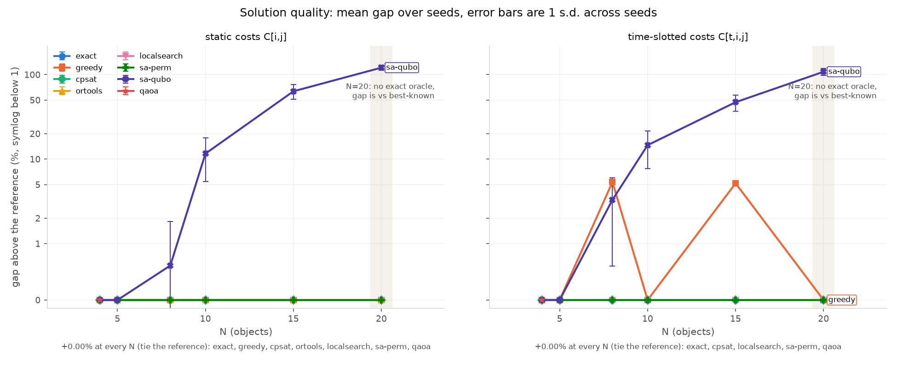
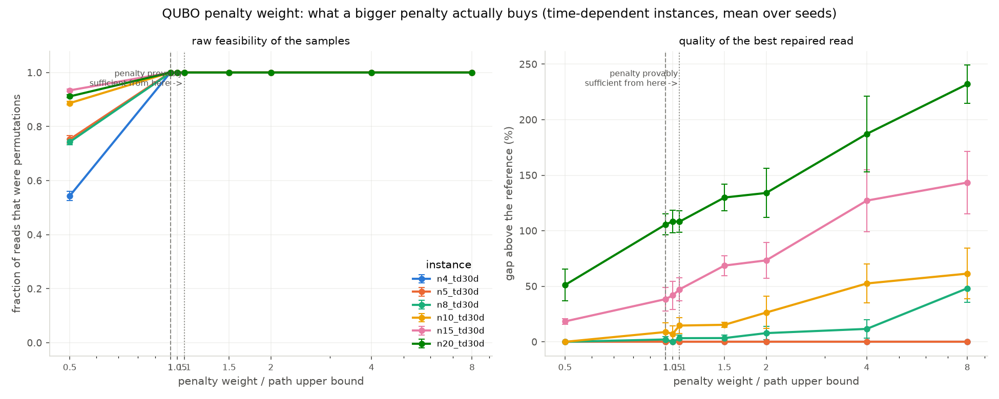
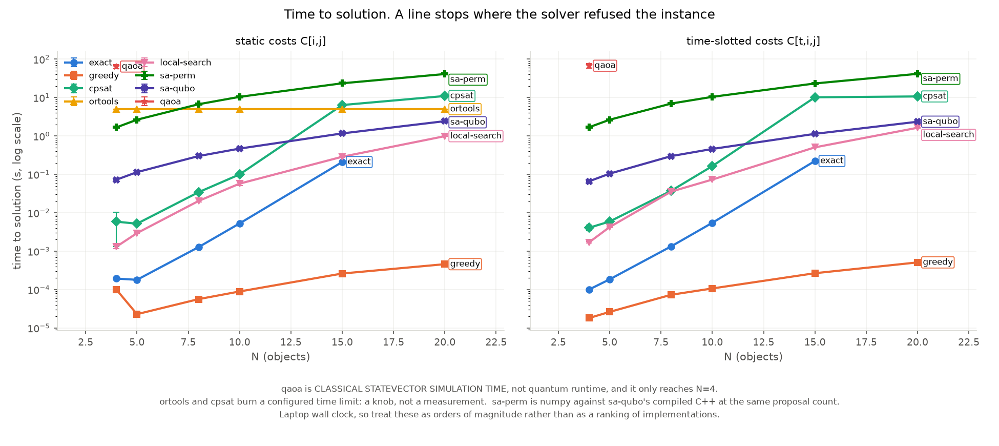
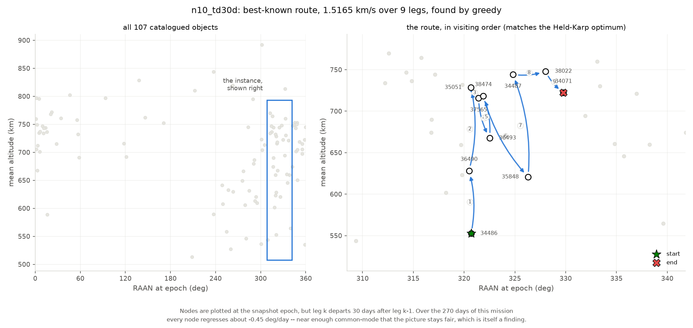

# Dextrivia

**An honest benchmark of classical, quantum-inspired and quantum solvers on a real orbital-debris sequencing problem.**

Given N catalogued fragments of the Iridium-33 debris cloud and a delta-v cost to
transfer between any two, find the visiting order that costs the least. The
deliverable of this repository is **the comparison**, not any one solver.



**Gap above the reference, mean ± 1 s.d. over 5 seeds.** Every cell comes from
[`results/canonical/summary.csv`](results/canonical/summary.csv). `exact` is
Held-Karp and is the reference wherever it ran; at N=20 it cannot run, so the
reference is the best result any solver achieved and is labelled **best-known**
— that is not an optimality gap and is not presented as one.

**Static costs `C[i,j]`**

| instance | N | reference (km/s) | `greedy` | `local-search` | `cpsat` | `ortools` | `sa-perm` | `sa-qubo` | `qaoa` |
|---|---|---|---|---|---|---|---|---|---|
| `n4_static` | 4 | 0.5946 *exact* | +0.00% | +0.00% | +0.00% | +0.00% | +0.00% | +0.00% | +0.00% |
| `n5_static` | 5 | 0.8296 *exact* | +0.00% | +0.00% | +0.00% | +0.00% | +0.00% | +0.00% | refused |
| `n8_static` | 8 | 1.0824 *exact* | +0.00% | +0.00% | +0.00% | +0.00% | +0.00% | +0.61% ± 1.22 | refused |
| `n10_static` | 10 | 1.3268 *exact* | +0.00% | +0.00% | +0.00% | +0.00% | +0.00% | +11.64% ± 6.22 | refused |
| `n15_static` | 15 | 2.0151 *exact* | +0.00% | +0.00% | +0.00% | +0.00% | +0.22% ± 0.27 | +63.57% ± 12.59 | refused |
| `n20_static` | 20 | 2.4485 **best-known** | +0.00% | +0.00% | +0.00% | +0.00% | +12.08% ± 2.49 | +121.04% ± 9.00 | refused |

**Time-dependent costs `C[t,i,j]`** (leg *k* departs 30 days after leg *k-1*)

| instance | N | reference (km/s) | `greedy` | `local-search` | `cpsat` | `ortools` | `sa-perm` | `sa-qubo` | `qaoa` |
|---|---|---|---|---|---|---|---|---|---|
| `n4_td30d` | 4 | 0.5205 *exact* | +0.00% | +0.00% | +0.00% | refused | +0.00% | +0.00% | +0.00% |
| `n5_td30d` | 5 | 0.8314 *exact* | +0.00% | +0.00% | +0.00% | refused | +0.00% | +0.00% | refused |
| `n8_td30d` | 8 | 1.1124 *exact* | **+5.37%** | +0.00% | +0.00% | refused | +0.00% | +3.30% ± 2.70 | refused |
| `n10_td30d` | 10 | 1.5165 *exact* | +0.00% | +0.00% | +0.00% | refused | +0.00% | +14.65% ± 6.95 | refused |
| `n15_td30d` | 15 | 2.1855 *exact* | **+5.18%** | +0.00% | +0.00% | refused | +2.77% ± 1.04 | +47.20% ± 10.27 | refused |
| `n20_td30d` | 20 | 3.6723 **best-known** | +0.00% | +0.00% | +0.00% | refused | +18.07% ± 6.65 | +108.17% ± 9.67 | refused |

"refused" is a recorded miss with a reason, not a crash and not a blank:
`qaoa` above N=4 (the qubit wall), `ortools` on every time-dependent instance
(a routing arc-cost callback cannot see how many legs have been flown), `exact`
above N=18 (Held-Karp memory).

### What this table says

**No quantum or quantum-inspired solver here beats the classical baselines.**
The three best solvers on this problem are `cpsat`, `local-search` and, almost
everywhere, plain `greedy`. That is the result.

**The QUBO encoding, not the annealing, is what fails.** `sa-perm` and `sa-qubo`
minimise the same objective with the same annealer budget — same reads, same
sweeps, and N² proposed moves per sweep on both sides. They differ only in what
they search: a permutation, or N² binaries with penalty terms. At N=15 that
difference is **+2.77% against +47.20%**, and at N=20 **+18.07% against
+108.17%**. Reporting `sa-qubo` without this control would have left the blame
ambiguous; with it, the position encoding is where the quality goes.

**Greedy is very hard to beat here, and only time dependence beats it.** Greedy
ties the exact optimum on all six static instances and on four of six
time-dependent ones. Its only two failures are `n8_td30d` (+5.37%) and
`n15_td30d` (+5.18%) — the cases where committing to a cheap early leg strands
the servicer in a plane that is expensive to leave once the nodes have drifted.
Those two cells are the entire headroom this benchmark contains.

---

## The problem, and why it matters

The 2009 Iridium-33 / Cosmos-2251 collision left more than 2,000 trackable
fragments in low Earth orbit. Active debris removal — sending a servicer to
capture several of them in one mission — is limited by propellant, so the
*order* in which targets are visited decides whether a mission is affordable.

The mission is an **open path, not a TSP tour**. The servicer starts at the
first object of the sequence and stops at the last. There is no return leg and
no depot, so a sequence over N objects has exactly **N-1 legs**. This matters
more than it sounds: the textbook TSP QUBO would charge the mission for a leg it
never flies, and every solver, cost model and formulation here is written
against the open-path definition.

Sequencing is NP-hard in general, which is what makes it a standard candidate
for quantum and quantum-inspired optimisation — and what makes an honest
classical baseline mandatory before anyone says the word "advantage".

---

## The physics model, and what it assumes

Full write-up: **[`docs/physics.md`](docs/physics.md)**.

Each object's orbit comes from its TLE, propagated with SGP4 to a common epoch —
the snapshot's **median TLE epoch**, never a hardcoded date. Transfer cost is a
two-burn impulsive manoeuvre between circular orbits at each object's **mean
semi-major axis**, with the plane change folded into the burns and the split
between them solved numerically rather than assumed.

The single fact that shapes everything:

| Quantity | This cloud |
|---|---|
| Mean altitude | 513 – 892 km |
| Inclination | 85.96° – 86.47° (spread **0.51°**) |
| RAAN | **the full circle** |
| Median pairwise plane angle | **45.5°** |
| Impulsive cost of that median plane change at 700 km | **5.80 km/s** |

Inclination alone says the cloud is one orbit. RAAN says it is 107 of them.
The exchange rate at 700 km is **1° of plane ≈ 0.131 km/s** against **100 km of
altitude ≈ 0.053 km/s** — both matter, which is exactly what makes the
sequencing non-trivial.


Because a median leg costs more than a launch to GEO, full-cloud tours are
physically absurd. Instances are built by a **`plane-cluster` rule** fixed before
any solver runs: keep the objects nearest a seed object in true plane angle.
The rule never looks at delta-v, let alone at which solver wins on the result.

**Time dependence.** J2 makes the orbital nodes regress. Leg *k* is priced at
`epoch + k · 30 days`, so a `td30d` instance carries a cost array `C[t,i,j]`
where `t` is the position of the leg in the sequence. The drift here is
**common-mode** (−0.405 to −0.505 °/day), so it largely cancels: the
*differential* rate for a median pair is 0.016 °/day, i.e. **612 days to change
their separation by 10°**. Waiting buys very little, and this repository does
not pretend otherwise.

### What the model still ignores

Phasing (the largest omission — the servicer is assumed to arrive at the right
point in the target's orbit for free), three-burn bi-elliptic transfers (so
every large-angle cost is an upper bound), eccentricity, finite burns and
gravity losses, time windows, propellant budget, vehicle constraints, and
conjunction-risk weighting. None of these exist here.

---

## Why the first version of this project was wrong

This repository began as an altitude-only tool. Three things were wrong with it,
and all three are visible in the git history rather than reconstructed.

**1. The propagation ran ~15 months backward.** `text_cost_matrix.py` in
[`e837989`](../../commit/e837989) hardcoded `datetime(2025, 1, 1, 12, 0, 0)`
while the TLE set's median epoch is `2026-04-02T07:05:22Z` — **455 days, 14.9
months, in the wrong direction**. SGP4 is a *fitted* model whose accuracy decays
away from its own epoch in either direction. Propagating this snapshot back to
that date moves mean altitudes by +20.0 km on average and up to 108 km, and
SGP4 refuses outright (error 6, decayed) on 1 of the 107 objects. The epoch is
now a parameter that defaults to the snapshot's median TLE epoch, and there are
no hardcoded calendar dates anywhere in the package.

**2. Altitude was the instantaneous radius, with the wrong Earth.**
`propagation.py` computed `|r| − 6371 km`. Two errors stacked: `|r|` oscillates
once per orbit (about 285 km peak-to-peak for the most eccentric object here),
and 6371 km is the mean spherical radius while SGP4 works internally in WGS72
(6378.135 km). Against the mean semi-major axis the old figure disagrees by
+8.9 km on average and up to **144 km** per object — encoding "where the object
happened to be at the chosen instant" into a cost matrix that is supposed to
describe its orbit. Altitude is now `Satrec.am`, the mean semi-major axis, with
WGS72 throughout.

**3. The benchmark was degenerate, which is the one that actually mattered.**
The coplanar Hohmann model derives every cost from **one scalar per object**.
Objects on a single scalar axis lie on a line, so the cheapest open path is just
"visit them in altitude order" — a sort. Nearest-neighbour greedy finds that
sort, so greedy tied the exact Held-Karp optimum at **0.1262 km/s** on the
10-object instance, and no solver of any kind could have demonstrated anything.
A benchmark where the baseline is provably optimal measures nothing.

This is locked down rather than deleted: [`tests/test_degeneracy.py`](tests/test_degeneracy.py)
still asserts that sorting by altitude *is* optimal under the altitude-only
model, so the degeneracy cannot quietly return. The plane-aware model made
altitude order **56–339% worse than optimal** on every instance in the committed
family, which is what created the headroom this benchmark measures.

---

## The QUBO formulation

Full write-up: **[`docs/qubo.md`](docs/qubo.md)**.

One binary per (object, position) pair, `x[i,p] = 1` when object *i* is visited
*p*-th, so **N² variables**:

```
H(x) = H_obj(x) + A · H_pen(x)

H_obj(x) = sum over p in 0..N-2 of  sum_ij  C_p[i,j] · x[i,p] · x[j,p+1]
H_pen(x) = sum_i (1 - sum_p x[i,p])²  +  sum_p (1 - sum_i x[i,p])²
```

The objective sum runs to `N-2`, giving **N-1 terms** — the open path again, no
wrap-around. `C_p` is `instance.leg_costs(p)`, so a time-slotted instance needs
no extra machinery: the QUBO's position index and the instance's time slot are
the same integer, and a time-dependent instance produces a QUBO of exactly the
same shape.

The penalty weight `A` is set to `1.1 × L_greedy`, a computable upper bound on
the optimum: since `H_pen ≥ 1` on anything that is not a permutation matrix and
`H_obj ≥ 0`, any `A > L*` makes every infeasible assignment worse than the
optimum. On a feasible assignment the energy is *exactly* the path cost in km/s.

**Raw and repaired results are kept apart everywhere.** `repair()` cannot fail,
so a repaired delta-v always exists; quoting it as a sampler result would make a
sampler that never once satisfied a constraint look successful.

---

## Conclusions

### Where simulated annealing stands

`sa-qubo` — simulated annealing on the QUBO — is the worst solver in this
benchmark at every size above N=5, and it degrades with N: +0.61% at N=8,
+11.64% at N=10, +63.57% at N=15, +121.04% at N=20 (static). Time-dependent
instances are no different (+3.30%, +14.65%, +47.20%, +108.17%).

The reason is **the encoding, not the annealer**. `sa-perm` anneals the same
objective, with the same sampler budget, over permutations instead of N²
penalised binaries:

| instance | `sa-perm` | `sa-qubo` | both at |
|---|---|---|---|
| `n10_td30d` | +0.00% | +14.65% ± 6.95 | 500 reads × 1000 sweeps |
| `n15_td30d` | +2.77% ± 1.04 | +47.20% ± 10.27 | 112.5 M proposed moves |
| `n20_td30d` | +18.07% ± 6.65 | +108.17% ± 9.67 | 200 M proposed moves |

Both counts are recorded in each solver's metadata, and the matched-budget
formula is asserted in `tests/test_bench_solvers.py`, so the claim is auditable
rather than assertable. Wall-clock is *not* matched and cannot be — `sa-qubo` is
compiled C++ and `sa-perm` is numpy — which is precisely why the comparison is
made on proposals.

The QUBO's penalty terms are not the problem either. **Raw feasibility is 1.00
at every penalty weight at or above the provable threshold, on every
time-dependent instance.** The constraints are satisfied; the objective is not
being optimised. See the penalty study below.

### Where QAOA stands

**QAOA runs at N=4 and nowhere else in this benchmark.** The position encoding
needs N² qubits and a dense statevector is 2^(N²) amplitudes: N=5 is 512 MB
before the optimiser evaluates anything, N=6 is 1 TB. `exact` — a
dynamic program from 1962 — reaches N=18 on the same laptop. **The quantum
solver's ceiling sits an order of magnitude below the classical oracle's, on
the same problem, in the same encoding. That gap is the headline quantum
result of this project.**

At N=4 the +0.00% gap in the table above **is not evidence of anything**. There
are 24 possible sequences among 2^16 bitstrings; best-of-4096-shots plus repair
recovers the optimum from uniform random bits. The only numbers at this size
that carry signal are the ones measured against chance:

| instance | raw feasibility | uniform baseline | P(optimal bitstring) | uniform P(optimal) | mean Δv of feasible samples | mean Δv of a random permutation |
|---|---|---|---|---|---|---|
| `n4_static` | **0.0344** ± 0.0251 | 0.000366 | **0.0049** ± 0.0041 | 0.0000305 (2 optimal sequences) | 0.9586 km/s | 1.0261 km/s |
| `n4_td30d` | **0.0270** ± 0.0229 | 0.000366 | **0.0016** ± 0.0017 | 0.0000153 (1 optimal sequence) | 0.9103 km/s | 0.9735 km/s |

Read honestly, that is one real effect and one disappointment:

* **QAOA concentrates amplitude on the feasible subspace**, by roughly 94× on
  the static instance and 74× on the time-dependent one, and on the optimal
  bitstring by 162× and 102×. The uniform baselines are exact, not estimated:
  24 permutation matrices among 65536 bitstrings, and the optimal-sequence
  count enumerated over all 24 orders. (`n4_static` has **two** optimal
  sequences because a static symmetric cost matrix makes a path and its reverse
  tie; time dependence breaks that symmetry, leaving one.)
* **Within the feasible set it barely optimises at all.** The mean delta-v of
  its feasible samples is 6.6% better than a uniformly random permutation on
  `n4_static` and 6.5% better on `n4_td30d`. It is finding permutations, not
  good permutations.

Every QAOA runtime in this repository is **classical statevector simulation
time** — 64.3 s ± 7.3 per run on `n4_static` and 67.6 s ± 8.5 on `n4_td30d`. It
is not a quantum runtime, and no quantum hardware was involved.

### Where OR-Tools and CP-SAT stand

`ortools` (routing, guided local search) ties the reference on **all six static
instances** and **refuses all six time-dependent ones**. A routing arc-cost
callback is a function of `(from, to)` and has no access to how many legs have
been flown, so it cannot express `C[t,i,j]`. It returns a recorded miss instead
of silently optimising a different problem.

`cpsat` — a position-indexed CP-SAT model added for this benchmark — has no such
blind spot, because indexing a leg variable by position is exactly what a time
slot is. **It ties the reference on all twelve instances**, including both
time-dependent ones and both N=20 ones, and it is the only solver here that can
certify anything: it proved optimality outright up to N=10. Two honest caveats:
it is **warm-started from greedy** (so its result is a statement about CP-SAT
*plus* greedy, recorded in its metadata), and its runtime is a **configured time
limit**, not a measurement.

`local-search` (2-opt + or-opt, evaluated through `path_cost` so it handles
time-slotted costs) also ties the reference on all twelve, at a tenth of the
CP-SAT time limit.

### The penalty study

`DEFAULT_PENALTY_SAFETY = 1.1` was calibrated on one easy instance. Across all
six time-dependent instances × 5 seeds × 8 weights, **it is dominated
everywhere**. Gap above the reference, mean over 5 seeds:

| instance | 0.5 | 1.0 | 1.05 | **1.1** | 1.5 | 2.0 | 4.0 | 8.0 |
|---|---|---|---|---|---|---|---|---|
| `n4_td30d` | +0.0 | +0.0 | +0.0 | **+0.0** | +0.0 | +0.0 | +0.0 | +0.0 |
| `n5_td30d` | +0.0 | +0.0 | +0.0 | **+0.0** | +0.0 | +0.0 | +0.0 | +0.0 |
| `n8_td30d` | +0.0 | +2.1 | +0.0 | **+3.3** | +3.4 | +7.9 | +11.6 | +48.2 |
| `n10_td30d` | +0.0 | +8.8 | +7.2 | **+14.7** | +15.3 | +26.4 | +52.6 | +61.4 |
| `n15_td30d` | +18.4 | +38.5 | +41.8 | **+47.2** | +68.7 | +73.4 | +127.2 | +143.4 |
| `n20_td30d` | +51.2 | +105.7 | +108.5 | **+108.2** | +129.9 | +134.0 | +187.2 | +232.0 |



Two things follow, and they point the same way:

1. **A bigger penalty buys no feasibility.** Raw feasibility is already 1.000 at
   weight 1.0 on every instance, and stays 1.000 through 8.0. Below the
   threshold it falls to 0.54–0.93 — and the *quality* there is the best on the
   whole table. The bound is worst-case; "provably sufficient" and "works well"
   are different properties.
2. **A bigger penalty costs quality, monotonically.** At `n15_td30d` the shipped
   default is nearly three times worse than weight 0.5. Raising the penalty
   compresses the objective into the numerical shadow of the constraint terms,
   and the sampler loses the ability to tell a good path from a mediocre one.

The default should be swept per instance rather than trusted. This does not
rescue `sa-qubo`: even its best weight at `n15_td30d` (+18.4%) is far worse than
`sa-perm` at +2.77%.

### Time to solution



Read with three caveats, all of which are printed on the figure: `qaoa` is
classical statevector simulation time; `ortools` and `cpsat` burn a configured
time limit, which is a knob and not a measurement; and `sa-perm` is numpy
against `sa-qubo`'s compiled C++ at an identical proposal count. These are
laptop wall-clock numbers — treat them as orders of magnitude, not as a ranking
of implementations.

### One route, drawn on the plane that costs delta-v



### How reproducible is any of this?

The canonical benchmark was executed four times while this was being built.
**All 108 gap cells were identical every time** — solution quality is fully
deterministic given the seeds, on every solver including the time-limited ones.

Wall-clock was not, and that is worth stating plainly because it is the part
most likely to be quoted:

* One run overlapped with other work on the machine and inflated the N=15 block
  by about 6×. Plotted, it drew `sa-perm` peaking at N=15 and *falling* at
  N=20 — the opposite of its own N² scaling.
* QAOA measured 145.6 s per run on a hot laptop and 64.3 s on a cool one, for
  identical output.

The committed run is the one made on an idle machine from a clean tree. This is
why the runtime figure carries three caveats and the quality tables carry none.

The manifest records `"dirty": true` with four `dirty_paths`, all of them the
run's own output files under `results/canonical/` — the run necessarily writes
into the tree it is measuring. No source file was uncommitted, which is exactly
what listing the paths rather than a bare boolean lets you check.

---

## Reproduce it

From a clean clone, three commands:

```bash
uv sync --all-extras                                   # 1. install, including optional backends
uv run dextrivia bench --out results/my-run            # 2. run every solver (~30 min)
uv run python scripts/plot_benchmark.py results/my-run # 3. regenerate every figure
```

A quick run, for checking the harness rather than reproducing the numbers:

```bash
uv run dextrivia bench --instances n4 --solvers greedy,exact,cpsat --seeds 1 --no-penalty-study
```

Tests, lint and format:

```bash
uv run pytest
uv run ruff check . && uv run ruff format --check .
```

Everything the benchmark needs is committed: the TLE snapshot
(`data/snapshots/iridium33_20260402.json`), the 12-file instance family
(`data/instances/`), and the canonical results run (`results/canonical/`). No
network access is required to reproduce any number in this README.

### What a results directory contains

| File | Contents |
|---|---|
| `results.csv` | one row per (instance, solver, seed) run |
| `summary.csv` | one row per (instance, solver): mean, standard deviation, best |
| `penalty_sweep.csv` | QUBO feasibility and quality against penalty weight |
| `manifest.json` | git SHA, per-instance sha256, library versions, CPU, seeds |

---

## Repository layout

```
src/dextrivia/
|-- core.py                 ProblemInstance / CostModel / Solver / Solution
|-- propagation.py          SGP4 wrapper, mean semi-major axis at an epoch
|-- snapshots.py            fetch / load / select immutable TLE snapshots
|-- instances.py            snapshot + selection + cost model -> instance
|-- bench.py                the benchmark harness
|-- cli.py                  dextrivia fetch | build | solve | bench
|-- costs/                  hohmann (baseline), realistic (plane-aware), selection
|-- qubo/                   open-path QUBO: formulation, decode, repair, penalty
|-- solvers/                greedy, exact, brute, local-search, sa-perm,
|                           sa-qubo, qaoa, ortools, cpsat
data/snapshots/             committed, timestamped TLE sets
data/instances/             the committed plane-cluster instance family
results/canonical/          the committed benchmark run this README cites
scripts/                    instance family, figures, benchmark output check
docs/physics.md             the cost models and their validation
docs/qubo.md                the QUBO formulation and its characterization
```

---

## Data sources

| Source | Description | License |
|--------|-------------|---------|
| [Celestrak](https://celestrak.org) | TLE catalog, Iridium-33 debris group | Free for non-commercial use |

TLEs are fetched from Celestrak's `gp.php` endpoint using the
`iridium-33-debris` group. No API key is required. Snapshots are immutable:
`dextrivia fetch` always writes a new file and never overwrites one, so a
benchmark can cite a filename.

The committed snapshot's `fetched_utc` is `null` — it predates the packaged
fetcher, which never recorded a download time. Inventing one would be worse than
admitting the gap.

---

## License

MIT. See [`LICENSE`](LICENSE).

## Acknowledgments

- [sgp4](https://pypi.org/project/sgp4/) by Brandon Rhodes, implementing the Vallado SGP4 formulation.
- [Celestrak](https://celestrak.org), maintained by T.S. Kelso.
- [D-Wave `dwave-samplers`](https://github.com/dwavesystems/dwave-samplers), [Qiskit](https://www.ibm.com/quantum/qiskit) and [Google OR-Tools](https://developers.google.com/optimization).
