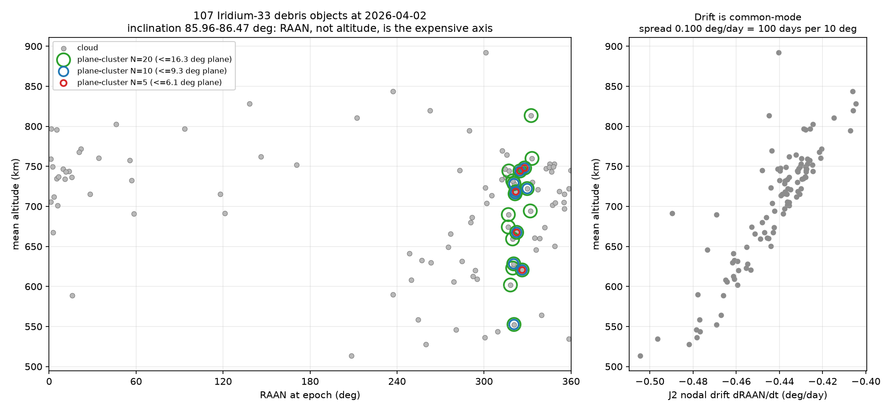
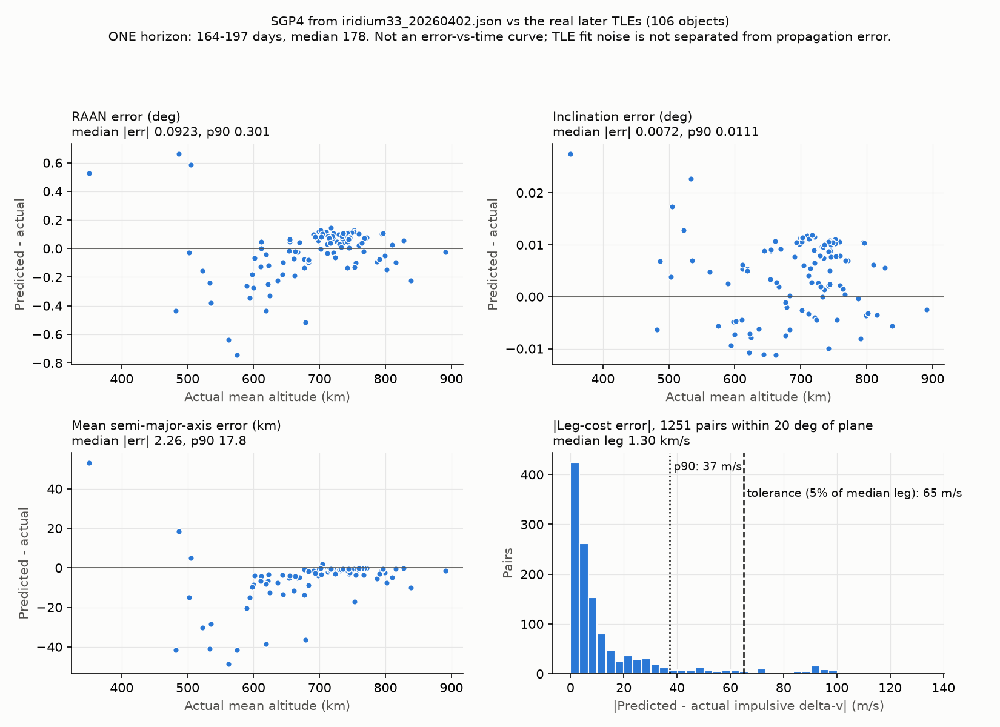

# Physics: what the cost models actually model

Scope: `src/dextrivia/costs/realistic.py` and `src/dextrivia/costs/selection.py`.
The baseline `costs/hohmann.py` is unchanged and still the default for
`dextrivia build`; everything here is opt-in and lives beside it, so the
"degenerate benchmark" control in `tests/test_degeneracy.py` keeps passing.

Sections 1–8 are measured against the committed snapshot
`data/snapshots/iridium33_20260402.json` (107 objects) at its median TLE epoch,
2026-04-02T07:05:22Z. Rerun them with `scripts/build_instance_family.py --version v1`
and `scripts/plot_cloud.py`. Sections 9–10 add a second snapshot,
`iridium33_20260928.json` (110 objects, median TLE epoch 2026-09-26T19:10:34Z),
check the first against it, and build the v2 family from it.

## 1. The problem with altitude-only costs

| Quantity | Value in this snapshot |
|---|---|
| Mean altitude (mean SMA − R⊕) | 513 – 892 km |
| Inclination | 85.96° – 86.47° (spread **0.51°**) |
| RAAN | 1.1° – 359.7° (**the full circle**) |
| Pairwise plane angle | median **45.5°**, max 172.8° |
| Impulsive plane change at the median angle, 700 km | **5.80 km/s** |
| Whole 10-object mission under `hohmann.py` | 0.126 km/s |

Inclination alone says the cloud is one orbit. RAAN says it is 107 of them. A
model that sees only altitude prices an entire mission at less than 3% of one
median leg's true plane change.

Exchange rate at 700 km, which is what makes the sequencing problem
two-dimensional and therefore non-trivial:

* **1° of plane ≈ 0.131 km/s**
* **100 km of altitude ≈ 0.053 km/s**



## 2. Plane angle

The true angle between two orbit planes, from inclination and RAAN:

```
cos θ = cos i₁ cos i₂ + sin i₁ sin i₂ cos(Ω₁ − Ω₂)
```

`|i₁ − i₂|` is not an approximation of this, it is a different quantity: it
reports ≤ 0.51° for every pair in this cloud while the truth reaches 172.8°.

## 3. Impulsive model — `ImpulsiveCostModel`

Two finite burns on a Hohmann transfer ellipse, with the plane change **folded
into the burns** rather than paid separately. Burn 1 does `s` of the rotation
and burn 2 the remaining `θ − s`; each burn's cost is the law of cosines
between the pre- and post-burn velocity vectors:

```
Δv(s) = √(v₁² + vₜ₁² − 2 v₁ vₜ₁ cos s) + √(v₂² + vₜ₂² − 2 v₂ vₜ₂ cos(θ − s))
```

`s` is chosen numerically to minimise the sum: the objective is smooth but not
convex, so the code does a 181-point global scan followed by golden-section
refinement inside the winning bracket (no scipy). The optimum is interior and
pushes most of the rotation onto the burn at the higher radius, where velocity
is lowest — but "most", not "all", and the share depends on the radius ratio,
which is why it is solved rather than assumed.

Implementation note: both terms are evaluated as `√((a−b)² + 4ab sin²(s/2))`.
That is algebraically the law of cosines, but the `a² + b² − 2ab cos s` form
loses ~9 significant digits exactly where this project needs them — small plane
angles between similar orbits, i.e. every leg inside a cluster.

**`separate_burn_dv` is the upper bound**: Hohmann + a standalone
`2 v sin(θ/2)` plane change at the higher orbit. It is never cheaper than the
combined burn (asserted for a grid of geometries in the tests). For a
300 km → GEO transfer with a 28.5° plane change: combined **4.23 km/s**,
separate **5.41 km/s**.

Validation (`tests/test_realistic_costs.py`, every case a number from outside
this repo):

| Case | Expected | Model |
|---|---|---|
| 300 km circular → GEO, coplanar | ~3.9 km/s | 3.893 km/s |
| θ = 0 | exactly `hohmann_dv` | exact to 1e-12 |
| r₁ = r₂ | `2v sin(θ/2)` | exact to 1e-9, for θ from 0.5° to 180° |
| GTO → GEO, 28.5° | ~4.2 km/s combined, ~5.4 km/s separate | 4.23 / 5.41 |

## 4. Low-thrust model — `EdelbaumCostModel`

Edelbaum (1961), the standard first-order estimate for an electric servicer in
active-debris-removal studies:

```
Δv = √(v₁² + v₂² − 2 v₁ v₂ cos(π/2 · θ))
```

Limiting cases, all asserted:

* θ = 0 → `|v₂ − v₁|`, the pure spiral.
* r₁ = r₂ → `2v sin(πθ/4)`, a pure low-thrust plane change — `π/2` times the
  impulsive `2v sin(θ/2)` for small angles.

**Low thrust never costs less Δv than impulsive for the same geometry.**
Rotating the velocity vector continuously is strictly worse than rotating it
once at the cheapest point. Its real advantage is propellant *mass* through
specific impulse, and this package measures delta-v only — so the Edelbaum
model will always lose here. That is a property of the metric, not of the
propulsion, and it is why the committed instance family uses the impulsive
model.

**Validity limit:** above θ ≈ 114.6° (2 rad) the effective angle `π/2·θ` passes
π and the closed form starts reporting *cheaper* transfers for *bigger* plane
changes. The effective angle is clamped at π, giving `v₁ + v₂` — stop dead and
re-accelerate. Treat any Edelbaum number above 114.6° as "too expensive to
matter" rather than as a quantity.

## 5. J2 nodal precession and the time-slot mapping

```
dΩ/dt = −3/2 · n · J₂ · (R⊕/p)² · cos i        p = a(1 − e²),  n = √(μ/a³)
```

WGS72 `J₂ = 1.082616e-3`, matching SGP4. Validated against published orbits:

| Orbit | Published | `nodal_precession_deg_per_day` |
|---|---|---|
| ISS-like, 400 km, 51.64° | ≈ −5.0 °/day | −5.00 °/day |
| Sun-synchronous, 700 km, 98.2° | +0.9856 °/day | +0.987 °/day |
| Polar, 90° | 0 | 0 |

and against SGP4's own node regression on real snapshot objects over 100 days:
**agreement within 0.3%** (test tolerance 2%).

### Slot semantics

`ProblemInstance` indexes time-dependent costs by *position in the sequence*,
not wall clock. This module supplies the missing map with one number:

> **leg _k_ departs at `t_k = epoch + k · Δ`**, where `Δ = delta_per_leg_days`
> is the whole per-object budget — transfer, rendezvous, capture, release.

Δ and the rule string are written into `ProblemInstance.metadata`
(`delta_per_leg_days`, `leg_departure_rule`). Δ is deliberately a single
constant: letting it depend on the leg would make departure time depend on
*which* objects were visited, which is the continuous-time scheduling problem
the slot convention exists to avoid.

`C[k, i, j]` is then the impulsive cost of i→j using each object's mean
elements propagated to `t_k`. Elements come from SGP4 itself (`Satrec.am/em/im/Om`
after propagation), so the node regression used in the costs is the
propagator's, including J4 and drag; the analytic `dΩ/dt` above exists to
explain and check that drift, not to replace it.

### How much does waiting actually buy? (Not much, and say so.)

The nodal drift of this cloud is **common-mode**: every object regresses at
−0.405 to −0.505 °/day, so the drift largely cancels in ΔΩ.

| | |
|---|---|
| Nodal rate | −0.405 to −0.505 °/day |
| **Differential** rate between a median pair | **0.016 °/day** |
| 90th percentile pair | 0.045 °/day |
| Fastest-separating pair | 0.100 °/day |
| Days to change a pair's RAAN separation by 10° | **612 days** (median), 100 days (fastest pair) |

So on a mission of weeks, differential drift is noise. On a *long* one it is
not: with Δ = 30 days over a 10-object mission (240 days), leg costs move by
0.44 km/s on average and up to 1.39 km/s between the first and last slot. That
is why the v1 family ships time-dependent variants at Δ = 30 d, and why they are
the instances greedy loses on.

**But a leg priced 240 days out is only as good as SGP4 240 days out.** Section
9 measures that against reality and sets a **177-day validity horizon**; four
of v1's six time-dependent instances exceed it.

### The loiter window, and why it is off by default

`ImpulsiveCostModel(window_days=..., window_samples=...)` defines
`C[k,i,j]` as the **minimum** over sampled departure times in
`[t_k, t_k + window]`. It is implemented, tested, and **disabled by default**,
for two reasons:

1. **It buys almost nothing here.** On the N=10 cluster with a 20-day window:
   median saving per leg **0.000 km/s** (drift usually makes a pair worse, so
   the minimum is just the nominal time), best leg 0.052 km/s.
2. **It is dishonest as an objective.** The minimum hands the servicer the
   drift discount without the objective ever paying for the 20 days of waiting.
   A model that rewards loitering must also charge for it — with a propellant
   budget for station-keeping, a mission-duration penalty, or a deadline. None
   of those exist in this package yet.

Turn it on only with the schedule cost in hand.

## 6. Target selection — `plane-cluster`

Full-cloud tours are physically absurd: a median leg costs 5.8 km/s, more than
a launch to GEO, *per leg*. Real ADR studies pick targets that already share a
plane. The rule (`costs/selection.py`):

1. Keep objects within `raan_window_deg` (10°), `inc_window_deg` (2°) and
   `alt_band_km` (250 km) of a **seed** object.
2. Seed = the object with the most neighbours surviving that filter, ties
   broken by lowest NORAD id. Pinnable with `seed_norad`.
3. Take the N survivors closest to the seed in *true plane angle*, ordering the
   instance by NORAD id.

The window is a radius around the seed, so a cluster's own span can be twice as
wide — measured and recorded per instance as `cluster_max_plane_angle_deg`.
The inclination window is effectively inert for this cloud (0.51° total spread)
and is kept for mixed catalogues.

The rule is fixed before any solver runs and never looks at delta-v, let alone
at which solver wins. Selecting instances by "where greedy loses" would cook
the benchmark this repository exists to produce.

Instances are assembled here rather than through `instances.build_instance`,
whose `rule` argument is `first`/`random` only (foundation-owned). No interface
in `core.py` changed; `build_cluster_instance` populates the same
`ProblemInstance` with a superset of the same metadata keys.

## 7. The committed instance family

`data/instances/iridium33_20260402_planecluster-v1_n{N}_{static|td30d}.npz`,
N ∈ {4, 5, 8, 10, 15, 20}, 12 files, regenerated by
`uv run python scripts/build_instance_family.py`. Δ = 30 days. Each file
records the snapshot filename, selection rule and window, epoch and its source,
cost model, Δ and the leg→wall-clock rule, and the family version.

Greedy (best-of-all-starts nearest neighbour) against the Held-Karp optimum,
plus what visiting in altitude order costs — the strategy that *was* exactly
optimal under the coplanar model:

| N | variant | exact (km/s) | greedy (km/s) | greedy gap | altitude order (km/s) | vs exact |
|---|---------|--------------|---------------|-----|-----------------------|----------|
| 4 | static | 0.5946 | 0.5946 | +0.00% | 0.9641 | +62.1% |
| 4 | time-dependent | 0.5205 | 0.5205 | +0.00% | 0.9752 | +87.4% |
| 5 | static | 0.8296 | 0.8296 | +0.00% | 1.3820 | +66.6% |
| 5 | time-dependent | 0.8314 | 0.8314 | +0.00% | 1.2986 | +56.2% |
| 8 | static | 1.0824 | 1.0824 | +0.00% | 2.5544 | +136.0% |
| 8 | time-dependent | 1.1124 | 1.1720 | **+5.37%** | 2.3730 | +113.3% |
| 10 | static | 1.3268 | 1.3268 | +0.00% | 5.1450 | +287.8% |
| 10 | time-dependent | 1.5165 | 1.5165 | +0.00% | 5.0583 | +233.5% |
| 15 | static | 2.0151 | 2.0151 | +0.00% | 8.8540 | +339.4% |
| 15 | time-dependent | 2.1855 | 2.2988 | **+5.18%** | 8.8066 | +302.9% |
| 20 | static | — exceeds Held-Karp limit 18 — | 2.4485 | — | 13.1215 | — |
| 20 | time-dependent | — exceeds Held-Karp limit 18 — | 3.6723 | — | 17.2940 | — |

Read honestly:

* **Altitude order is dead.** It is 56–339% worse than optimal on every
  instance, and is never the optimal sequence. The degeneracy the old model had
  is gone.
* **Greedy still ties the optimum on every static instance.** A static
  plane-aware matrix is still symmetric and near-metric, and nearest-neighbour
  from all N starts finds the optimum at these sizes. Claiming otherwise would
  be the easy lie; the cost model got real, greedy did not get worse.
* **Time dependence is what breaks greedy** — 5.4% at N=8, 5.2% at N=15.
  Greedy commits to a cheap early leg and pays for it when the planes have
  drifted; Held-Karp plans around the drift. This is the headroom a
  quantum/quantum-inspired solver has to compete for.
* **N=20 records a miss, not a crash**, which is what the exact solver's
  `feasible=False` contract is for.

**v1 is frozen, and four of its instances propagate past the validity horizon
(section 9).** They stay committed byte-for-byte, because the README's
canonical benchmark run cites them. `tests/test_propagation_validity.py` pins
their sha256 and asserts which ones are flagged:

| v1 instance | propagation span | vs 177-day horizon |
|---|---|---|
| `n4_td30d` | 60.4 d | inside |
| `n5_td30d` | 93.4 d | inside |
| `n8_td30d` | 183.4 d | **exceeds** |
| `n10_td30d` | 243.4 d | **exceeds** |
| `n15_td30d` | 394.9 d | **exceeds** |
| `n20_td30d` | 544.9 d | **exceeds** |

The static v1 instances are all within 5 days of their TLE epochs.
`dextrivia.costs.validity.check_instance` reports this for any saved instance.
v2 (section 10) is the replacement that stays inside the horizon.

## 8. What is still missing

In rough order of how much delta-v it is worth:

1. **Phasing.** The servicer is assumed to arrive at the right point in the
   target's orbit for free. In reality that is paid in delta-v or in waiting,
   and for a dense plane usually waiting. The single largest omission.
2. **Three-burn (bi-elliptic) transfers.** Above ~60° of plane angle, raising
   apoapsis to rotate cheaply beats the two-burn manoeuvre. Every large-angle
   cost here is therefore an upper bound.
3. **Eccentricity.** Orbits are treated as circular at the mean semi-major
   axis. Real e is 8e-5 … 2.1e-2, biasing a transfer by ~13 m/s at the median
   and ~160 m/s for the worst object.
4. **Finite burns and gravity losses** — a few percent for a chemical stage.
5. **Argument-of-perigee drift**, J2 effects during the transfer itself,
   lunisolar and drag perturbations beyond what SGP4's mean elements carry.
6. **Time windows, propellant budget, vehicle constraints, conjunction risk
   weighting.** None of them exist.
7. **An error-vs-time curve for SGP4.** Section 9 is one horizon from two
   snapshots. Daily TLE history (Space-Track `gp_history`) would give the curve
   and the fit-noise floor.

A cost that is an upper bound is stated as one. Nothing here has been tuned to
make any solver look good.

## 9. Validation against reality, and the validity horizon

SGP4 is a fitted model: a TLE is a least-squares fit to days of tracking, and
its accuracy decays away from the epoch in both directions. The original
version of this project propagated 455 days *backward* (README, "Why the first
version was wrong"). The v1 family propagates up to 545 days *forward*. Until
now nothing measured how far forward is safe.

`scripts/validate_propagation.py` takes the 106 objects present in both
snapshots (matched by NORAD id). It propagates each April TLE to that object's
September TLE epoch and compares the result with the September TLE's own mean
elements. Output: `data/validation/propagation_iridium33_20260402_vs_iridium33_20260928.json`.

**What this is and what it is not.**

* **It is a single-horizon measurement.** Each object gives one propagation
  span, between 164 and 197 days (median 177.5). This is **not an
  error-vs-time curve**. Growth rates quoted below assume the error grows
  linearly in time. That is reasonable for the secular RAAN and inclination
  rate errors and optimistic for drag-driven semi-major-axis error, which
  compounds.
* **The TLE fit-noise floor is unmeasured.** With two snapshots, part of each
  "error" may be fit noise in the September TLE rather than propagation error
  from the April one. Separating the two needs a time series of TLEs.



### Element errors at the measured span (predicted − actual, 106 objects)

| Element | median abs | p90 abs | max abs | p90 per 30 d, if linear |
|---|---|---|---|---|
| RAAN | 0.092° | 0.30° | 0.74° (33960) | 0.051° |
| Inclination | 0.0072° | 0.011° | 0.027° (35622) | 0.0019° |
| Mean semi-major axis | 2.3 km | 17.8 km | 53.3 km (35622) | 3.0 km |

**The error is drag, and it is concentrated below ~650 km.**

| Stratum | objects | RAAN median / p90 | SMA median / p90 | SMA mean signed |
|---|---|---|---|---|
| actual altitude < 650 km | 26 | 0.25° / 0.61° | 13.0 / 41.6 km | −13.0 km |
| actual altitude ≥ 650 km | 80 | 0.08° / 0.13° | 1.5 / 5.2 km | −2.8 km |

The negative mean means SGP4 **over-decayed** the low objects. April's B*
drag terms predicted more decay than happened, so the predicted orbits sit too
low. That is the expected failure of a fixed drag term when atmospheric density
changes over half a year.

**Growth rate in delta-v terms**, at the exchange rates of section 1:

* **RAAN, p90:** 0.051° per 30 days, at most ≈ 6.7 m/s per 30 days for a
  single leg. It is less in practice, because much of the RAAN error is
  common-mode and cancels in the plane angle.
* **Semi-major axis, p90:** 3 km per 30 days ≈ 1.6 m/s.
* **Inclination:** negligible.

**Leg costs, which is what matters.** The table below covers the 1,251 pairs
within 20° of plane, comparing predicted and actual impulsive Δv at the
September epoch:

| | median | p90 | max |
|---|---|---|---|
| Plane-angle error | 0.045° | 0.30° | — |
| Leg-cost error | 5.7 m/s | **37 m/s** | 134 m/s |
| Median in-cluster leg | 1.30 km/s | | |

### The horizon rule, and the number

The rule was fixed before the numbers were computed:

> The horizon is the longest propagation span at which the **90th-percentile
> in-cluster leg-cost error stays ≤ 5% of the median in-cluster leg cost**. It
> is scaled linearly down from the measured point, which is conservative if the
> true growth is super-linear, and **capped at the measured span**, so nothing
> beyond the evidence is claimed.

At the measured span the error is 37 m/s against a 65 m/s tolerance, so the cap
binds:

> **`VALIDITY_HORIZON_DAYS = 177`**: the median measured span, floored to
> whole days.

`tests/test_propagation_validity.py` recomputes this from the two committed
snapshots and fails if the constant drifts from the evidence.

**The horizon is a population statement.** Pairs involving an object below
650 km have a p90 of **89 m/s**, which already exceeds the tolerance at the
measured span. Scaled linearly, that stratum reaches the tolerance at about
**129 days**. The pooled rule is the one that was pre-registered, and it is not
being moved after the fact. Treat low-altitude legs in long instances as the
least trustworthy numbers in the family (see section 10).

### What this means for 30-day legs

Leg *k* departs at `epoch + k·Δ`. The span is therefore `(N−2)·Δ` plus the age
of the oldest TLE, which is up to 21 days here. At Δ = 30 days, **N ≤ 7 fits
inside the horizon**. Beyond that, a 30-day schedule prices its last legs with
orbits SGP4 has not been shown to predict.

The v1 `n20_td30d` reaches 545 days, three times the measured span. A linear
extrapolation of the pooled p90 gives ~115 m/s there, and drag makes linear
optimistic.

For scale: the drift the time-dependent costs exist to capture moves leg costs
by 0.44 km/s over 240 days (section 5). The propagation error at 177 days is
about a tenth of that. The time dependence is real signal inside the horizon,
but not so far above the error that the horizon can be ignored.

### Decay: SGP4 is late, and it used to crash the build

**What left the catalogue.** One object, 35080, is in April and not in
September. Celestrak SATCAT (committed as `data/validation/satcat_20260928.json`)
records its re-entry on **2026-07-10**, 99 days after the April epoch. SGP4,
from the April TLE, keeps propagating it until **day 219 (2026-11-07), 120 days
late**. The four objects that appear only in September (35625, 37136, 38477,
46979) have no decay date and are still in orbit. They were simply absent from
the April group listing: catalogue churn, not physics.

**The old crash.** Selection used to hand every candidate to the cost model.
Any object SGP4 had decayed by some leg's departure time raised
`RuntimeError: SGP4 error 6` inside `mean_elements`. The N=30, Δ=30 d
plane-cluster build (20° window, 840 days) crashed this way.

**Now.** `select_plane_cluster` first screens every candidate at every time the
cost model will price (`validity.screen_decay`). Objects SGP4 cannot propagate
are dropped **before the seed is chosen** and recorded in the instance's
`excluded_decayed` metadata (NORAD id, SGP4 error code, first failing time). The
same N=30 build now succeeds, excludes 10 objects, and warns that it exceeds
the horizon.

This screen only catches what SGP4 itself predicts. 35080 shows SGP4 predicting
too late, which is one more reason to stay inside the horizon.

### Metadata every new instance carries

* `propagation_span_days`: the largest |t − TLE epoch| over the selected
  objects and every priced time, in both directions.
* `validity_horizon_days`, `validity_horizon_source`.
* `exceeds_validity_horizon`. When true, the build emits a
  `PropagationHorizonWarning`.
* `excluded_decayed` (plane-cluster only).

`build_instance` (`first` / `random`, Hohmann) records the same horizon keys.
Its `--epoch` flag is exactly how the original 455-day error happened, and it
now gets flagged.

## 10. The v2 instance family

`data/instances/planecluster-v2/iridium33_20260928_planecluster-v2_n{N}_{static|td{Δ}d}.npz`
has 31 files, built by `uv run python scripts/build_instance_family.py` from
the fresh snapshot. It lives in a subdirectory so that `dextrivia bench`'s flat
glob and its short labels (`n8_td30d`) never mix v1 and v2. Every file is
reproducible from the CLI, and the script prints the exact command beside each
one:

```bash
uv run dextrivia build --snapshot data/snapshots/iridium33_20260928.json \
    --select plane-cluster --cost-model impulsive-plane --n 25 --delta-days 7 \
    --raan-window 20 --family-version v2
```

**Per-leg durations.** Candidates are Δ ∈ {3, 7, 14, 30} days. Each is kept for
a given N only if the instance's propagation span stays inside the 177-day
horizon. That removed 14 of the 36 time-dependent candidates, including every
Δ = 30 d instance above N = 5.

The values bracket the one per-target cost this model leaves out, **phasing**
(section 8, item 1). At 700 km, an altitude difference of Δa drifts the
servicer's phase relative to the target by `1.5 · n · Δa / a` per unit time.
For Δa = 50 km, a full 360° cycle takes **6.5 days**. So:

* 7 d allows a complete worst-case phasing wait at a modest altitude
  difference, plus rendezvous and capture.
* 3 d is an aggressive schedule. It is feasible only with the larger in-cluster
  altitude differences, which phase faster.
* 14 d and 30 d are relaxed schedules, kept where the horizon allows them.

**Sizes.**

* N ∈ {4, 5, 8, 10, 15, 20} use v1's window (10° RAAN, 2° inclination,
  250 km).
* N ∈ {25, 30, 40} use the **smallest RAAN window in {15, 20, 25, 30}° in which
  the densest seed holds 40 surviving objects**. That is **20°**; 15° holds
  only 32. The window is chosen by object count, never by delta-v or by which
  solver does well.

Every v2 instance has `exceeds_validity_horizon = false` (asserted in tests).
**Every time-dependent v2 instance excludes one object, 35622.** It is the
lowest object in the cloud (~350 km), has the worst semi-major-axis error in
the validation above (53 km), and SGP4 has it decaying within days of the
September epoch (first failure between 2026-10-03 and 2026-10-26, depending on
Δ). The static instances price only at the epoch, where it still propagates, so
it stays in their candidate pool. Either way the decision is recorded in
`excluded_decayed`, never silently made.

In the table below, `slot drift` is the mean |C[last] − C[0]| over pairs as a
percentage of mean C[0], i.e. how time-dependent the instance really is.
Above N = 18 the reference is **best-known**, the better of greedy and
localsearch. localsearch's +0.00% there is therefore true by construction and
says nothing.

| N | Δ (d) | RAAN window | span (d) | slot drift | reference (km/s) | greedy | localsearch | altitude order |
|---|---|---|---|---|---|---|---|---|
| 4 | static | 10° | 10.6 | – | 0.1875 *exact* | +0.00% | +0.00% | +65.7% |
| 4 | 3 | 10° | 16.6 | 2.99% | 0.1892 *exact* | +0.00% | +0.00% | +64.3% |
| 4 | 7 | 10° | 24.6 | 6.55% | 0.1942 *exact* | +0.00% | +0.00% | +60.1% |
| 4 | 14 | 10° | 38.6 | 13.15% | 0.1978 *exact* | +0.00% | +0.00% | +57.3% |
| 4 | 30 | 10° | 70.6 | 33.18% | 0.1980 *exact* | +0.00% | +0.00% | +57.3% |
| 5 | static | 10° | 10.6 | – | 0.2932 *exact* | +0.00% | +0.00% | +42.0% |
| 5 | 3 | 10° | 19.6 | 2.97% | 0.2946 *exact* | +0.00% | +0.00% | +41.3% |
| 5 | 7 | 10° | 31.6 | 6.48% | 0.2936 *exact* | +1.87% | +0.00% | +41.6% |
| 5 | 14 | 10° | 52.6 | 14.26% | 0.2746 *exact* | +0.00% | +0.00% | +51.2% |
| 5 | 30 | 10° | 100.6 | 31.80% | 0.2732 *exact* | +0.00% | +0.00% | +51.6% |
| 8 | static | 10° | 10.6 | – | 0.8346 *exact* | +0.00% | +0.00% | +101.1% |
| 8 | 3 | 10° | 28.6 | 6.73% | 0.8123 *exact* | +0.00% | +0.00% | +108.5% |
| 8 | 7 | 10° | 52.6 | 15.90% | 0.7676 *exact* | +3.14% | +0.00% | +123.4% |
| 8 | 14 | 10° | 94.6 | 31.58% | 0.7356 *exact* | +0.00% | +0.00% | +138.1% |
| 10 | static | 10° | 10.6 | – | 1.2731 *exact* | +0.00% | +0.00% | +185.7% |
| 10 | 3 | 10° | 34.6 | 7.09% | 1.2993 *exact* | +0.00% | +0.00% | +182.3% |
| 10 | 7 | 10° | 66.6 | 16.47% | 1.3373 *exact* | +1.96% | +0.00% | +177.3% |
| 10 | 14 | 10° | 122.6 | 32.27% | 1.4102 *exact* | +0.00% | +0.00% | +168.2% |
| 15 | static | 10° | 10.6 | – | 1.9215 *exact* | +0.00% | +0.00% | +248.4% |
| 15 | 3 | 10° | 49.6 | 11.21% | 1.9484 *exact* | +0.00% | +0.00% | +241.4% |
| 15 | 7 | 10° | 101.6 | 26.35% | 2.0331 *exact* | +4.66% | +0.00% | +224.3% |
| 20 | static | 10° | 10.6 | – | 2.4123 *best-known* | +0.00% | +0.00% | +599.1% |
| 20 | 3 | 10° | 64.6 | 13.29% | 2.5321 *best-known* | +0.00% | +0.00% | +568.0% |
| 20 | 7 | 10° | 136.6 | 31.83% | 2.6467 *best-known* | +2.90% | +0.00% | +541.6% |
| 25 | static | 20° | 10.6 | – | 3.5864 *best-known* | +0.00% | +0.00% | +756.8% |
| 25 | 3 | 20° | 79.6 | 10.09% | 3.6015 *best-known* | +1.83% | +0.00% | +755.8% |
| 25 | 7 | 20° | 171.6 | 23.59% | 3.6630 *best-known* | +1.00% | +0.00% | +744.8% |
| 30 | static | 20° | 10.6 | – | 4.5135 *best-known* | +0.00% | +0.00% | +759.8% |
| 30 | 3 | 20° | 94.6 | 11.42% | 4.5952 *best-known* | +0.55% | +0.00% | +741.6% |
| 40 | static | 20° | 21.0 | – | 5.5281 *best-known* | +0.23% | +0.00% | +1275.4% |
| 40 | 3 | 20° | 135.0 | 13.02% | 5.7308 *best-known* | +0.75% | +0.00% | +1244.7% |

Read honestly:

* **Shorter legs are still time-dependent.** Even at Δ = 3 d, slot drift is
  3–13%, because the drift accumulates over the whole mission and N×3 d is
  still months at large N.
* **Greedy loses on nine time-dependent instances and one static one**
  (`n40_static`, the first static instance anywhere in this project where
  greedy is not at the reference), by up to +4.66%.
* **localsearch still ties the reference wherever the reference is exact**
  (N ≤ 15). v2 does not fix the "no headroom" finding for small N. What it adds
  is N = 25–40 with a wider window, where no oracle exists. Whether any solver
  can beat localsearch there is the question for the next workspace, not a
  result here.
* **Three instances combine low-altitude objects with spans past ~129 days**:
  `n20_td7d`, `n25_td7d` and `n40_td3d`. Their sub-650 km legs are the
  least-validated numbers in v2 (see section 9). Every v2 cluster with N ≥ 8
  contains 2–9 objects below 650 km.

## 11. Why the plane-cluster families are easy, and the v3 `collision-pair` family

### The finding: static plane-cluster instances are one-dimensional

The diagnostics defined below were run on every v1 and v2 file with
`scripts/build_instance_family.py --check --diagnostics`. The output is in
`docs/data/instance_diagnostics.json`. For every instance, classical MDS puts
0.96–1.00 of the cost matrix's variance on a single axis.

* **Static v2 is exactly 1-D.** Visiting in RAAN order is a sort, not a
  search. On 8 of the 9 static v2 instances it meets the certified cut-LP
  bound (0.00%), and on `n40_static` it is within 0.23%. It is provably
  optimal, or within a quarter of a percent of it. The objects share an
  inclination to 0.5°, so plane angle is RAAN difference, and RAAN spread
  dominates altitude spread (1° of plane ≈ 0.131 km/s, 100 km ≈ 0.053 km/s).
  This is the altitude-only degeneracy of README point 3 again, rotated onto
  RAAN.
* **Static v1 is nearly so.** RAAN order is within 2.1–5.6% of the bound at
  N ≥ 8. The April snapshot at a 10° window leaves slightly more altitude
  structure.
* **Time-dependent instances are *not* 1-D, and are easy anyway.** RAAN order
  is 2–77% above the bound on them, because drift reorders the planes over the
  mission. They are easy for a different reason: the drift is a perturbation
  of a 1-D problem (slot drift 3–33% in v2), and 2-opt/or-opt from the greedy
  path repairs it. Whether that repair is optimal is what the certified bounds
  in the benchmark answer.

A wider window does not help. The Iridium-33 cloud has about 110 objects
spread over 360° of RAAN, so any large cluster is a strip along RAAN.

### v3: both halves of the collision (pre-registered)

`data/instances/collisionpair-v3/` has 13 files, built by
`uv run python scripts/build_instance_family.py --version v3` from
`iridium33_20260928.json` and a new snapshot, `cosmos2251_20260930.json`
(583 objects, fetched 2026-09-30T05:46Z with `dextrivia fetch --group
cosmos-2251-debris`). Cosmos-2251 debris sits at 74.0° inclination against
Iridium-33's 86.4°, so plane angle between the two clouds depends on
inclination as well as RAAN.

**The rule** (`selection.select_collision_pair`), fixed before any solver ran:

1. The seed is the `plane-cluster` seed of the Iridium-33 cloud: the densest
   plane, decay-screened. Here that is 37565 (714 km, 86.34°, RAAN 243.9°).
2. Each cloud contributes half of the N objects, with Iridium taking the odd
   one. These are the objects within 250 km of the seed's altitude that are
   nearest to the seed in true plane angle, with NORAD id breaking ties. There
   is no RAAN window; the ranking is the window.
3. N ∈ {10, 20, 30, 40, 50, 60}, static and Δ ∈ {3, 7} days, each kept only
   inside the 177-day horizon. That gives 13 files, with Δ=3 d up to N=50 and
   Δ=7 d up to N=20.

**Validity is borrowed.** The 177-day horizon was measured on Iridium-33 only
(section 9). No Space-Track TLE history was available to this workspace, so
the Cosmos-2251 half has **no measured horizon**. Every v3 instance carries
`validity_horizon_note: "horizon measured on Iridium-33 only; not validated
for Cosmos-2251"`. Treat time-dependent v3 costs for Cosmos objects as
unvalidated.

**Realism caveat.** Crossing between the clouds costs at least the 12.4°
inclination difference, about 1.6 km/s per crossing. A real servicer would
stay in one plane. v3 exists to find out whether *any* real-data geometry
from this collision gives a solver something to do. It is not a mission
proposal, and it should not be quoted as one.

**Time dependence is large, and it is physical.** The two clouds' nodes
regress at different rates (J2 goes as cos i), about 0.85°/day apart. Over a
mission of weeks the two planes slide past each other. Slot drift, as defined
in section 10, is 175–667% for v3, against 3–33% for v2. A cross-cloud leg
flown at the wrong time costs several km/s.

### Pre-registered diagnostics, computed before any solver ran on v3

For each instance the diagnostics record:

* **MDS axis 1 / 2.** The share of classical-MDS variance on the first one and
  first two axes of the slot-0 cost matrix. A value of 0.99 on axis 1 means the
  costs are distances along a line.
* **RAAN order.** Visit every object in RAAN order, taking the better
  direction.
* **Strip order.** Visit each cloud contiguously in RAAN order, taking the best
  of the 8 combinations ("two strips crossed once").
* **The cut-LP lower bound** (`highs_mip.lp_lower_bound`). This is a
  relaxation. It is not a heuristic, a branch-and-bound or a sequence search.
  Because it is a lower bound, "vs bound" below is an upper bound on how far
  each sort is from optimal.

**The rule, fixed with the family:** an instance is *effectively 1-D* when
strip order is within **1%** of the certified bound. If every v3 instance
passes, v3 is reported as effectively 1-D and no other geometry is tried.

| instance | MDS axis 1 / 2 | RAAN order (km/s) | strip order (km/s) | cut-LP bound (km/s) | RAAN order vs bound | strips vs bound | 1-D? |
|---|---|---|---|---|---|---|---|
| `n10_static` | 0.97 / 1.00 | 6.7695 | 2.3605 | 2.3604 | <= 65.13% | <= 0.00% | yes |
| `n10_td3d` | 0.97 / 1.00 | 11.2370 | 3.2004 | 2.2121 | <= 80.31% | <= 30.88% | not shown |
| `n10_td7d` | 0.97 / 1.00 | 20.4672 | 5.9414 | 2.2530 | <= 88.99% | <= 62.08% | not shown |
| `n20_static` | 0.85 / 1.00 | 13.7888 | 3.9724 | 3.9575 | <= 71.30% | <= 0.37% | yes |
| `n20_td3d` | 0.85 / 1.00 | 35.3527 | 7.7569 | 3.6221 | <= 89.75% | <= 53.30% | not shown |
| `n20_td7d` | 0.85 / 1.00 | 66.7026 | 15.5932 | 3.8421 | <= 94.24% | <= 75.36% | not shown |
| `n30_static` | 0.76 / 1.00 | 23.8165 | 5.2249 | 5.1700 | <= 78.29% | <= 1.05% | not shown |
| `n30_td3d` | 0.76 / 1.00 | 95.4038 | 12.5886 | 4.3932 | <= 95.40% | <= 65.10% | not shown |
| `n40_static` | 0.64 / 1.00 | 36.7752 | 6.3285 | 6.2776 | <= 82.93% | <= 0.80% | yes |
| `n40_td3d` | 0.64 / 1.00 | 201.8562 | 19.0266 | 5.1076 | <= 97.47% | <= 73.16% | not shown |
| `n50_static` | 0.57 / 0.99 | 49.9226 | 7.3705 | 7.2836 | <= 85.41% | <= 1.18% | not shown |
| `n50_td3d` | 0.57 / 0.99 | 311.8815 | 25.4788 | 5.8367 | <= 98.13% | <= 77.09% | not shown |
| `n60_static` | 0.56 / 0.99 | 59.7203 | 8.5373 | 8.4777 | <= 85.80% | <= 0.70% | yes |

Read honestly, before any solver result exists:

* **Static v3 is two strips crossed once.** Two MDS axes carry 99–100% of the
  variance. Strip order is within 0.0–1.2% of a certified bound on all six
  static instances. That is 1-D by the rule on four of them, and 1.05% and
  1.18% on the other two, just past the pre-registered line. Adding the second
  cloud gave the static problem one extra degree of freedom (which strip to fly
  first), not a two-dimensional one.
* **Time-dependent v3 is not shown to be 1-D.** Strip order is 31–77% above
  the bound. Part of that is the cut LP being weak on time-slotted costs, which
  is also true of v1 `n20_td30d`, where the cut LP gives 2.4460 km/s against
a proven optimum of 3.6723 (`docs/bounds.md`). The rest is
  genuine: a fixed strip order crosses between the clouds at whatever time it
  happens to reach the boundary, and the drifting planes punish that.
  Whether any solver beats localsearch here is what the benchmark is for.
